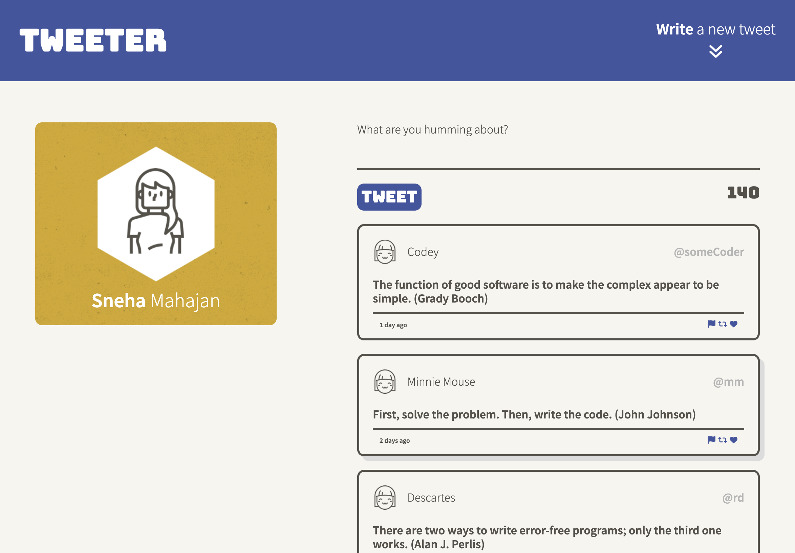
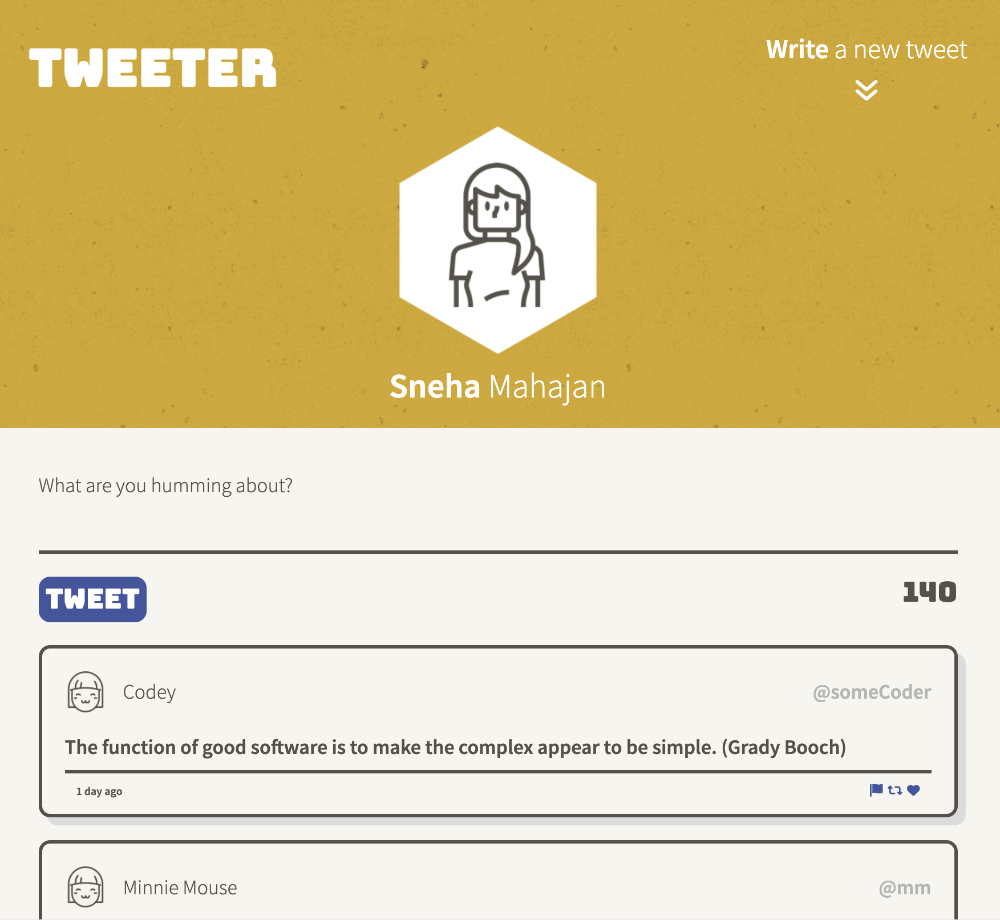
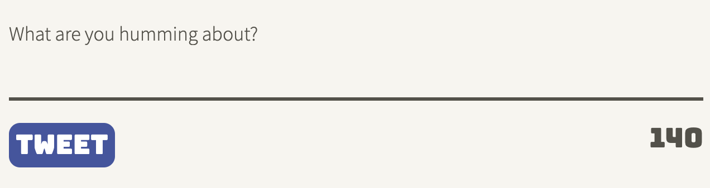
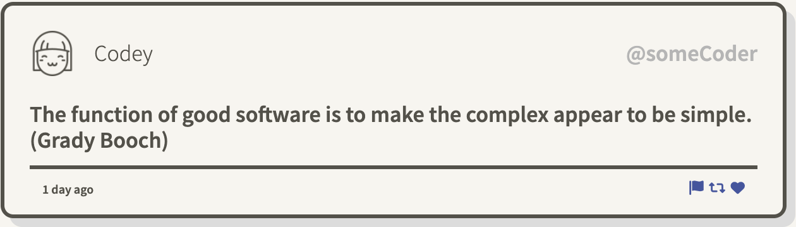

# Tweeter Project

Tweeter is a simple, single-page AJAX based Twitter clone. HTML, CSS3 and JQuery have been used to create the front-end.

## Final Product

1. Desktop view

2. Tablet & cellphone view

3. Tweet form

4. Tweet

## Dependencies

- body-parser
- chance
- express
- md5
- sass

## Getting Started

1. Install dependencies using the `npm install` command.
2. Start the web server using the `npm run local` command. The app will be served at <http://localhost:8080/>.
3. Go to <http://localhost:8080/> in your browser.
4. Tweet form slides down by clicking on the bouncy white arrows and user can directly start typing their tweet.
5. Tweets cannot exceed **140** characters and cannot be **empty**. User will be alerted if these conditions are not met.
6. Scroll down to see existing tweets in the static database. 
7. Scroll up by clicking the up button on the bottom of the screen.

